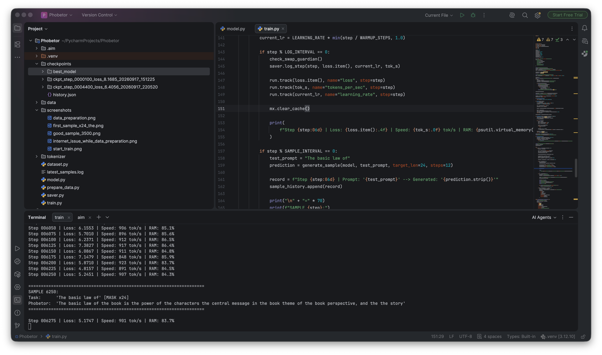
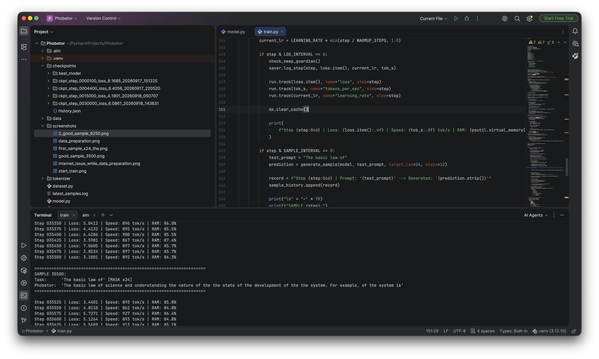

# Phobetor

I'm building a small text generation model through experiments with architecture,
training, and sampling. The idea is to generate text in overlapping blocks and
let the model revise them before moving on. I use MLX and train on an Apple
Silicon Mac while I work out what works.

## How it works

I combine bidirectional Mamba-2, attention, and SwiGLU in eight blocks and run
through them twice with shared weights. The model can look at the whole available
context, but generation happens inside a small active window.

In V4, that window holds 16 tokens. The sampler fills masked positions, checks
its confidence, and masks some predictions again so the model can revise them.
After 12 rounds of refinement, the window moves four tokens to the right:
12 tokens remain editable and four new positions open up. The prompt and
committed text stay fixed.

For training, I take a text prefix and mask part or all of the next block.
Mask counts from 1 to 16 are balanced across training cycles. Each example teaches
one denoising step; the 12-round generation loop runs during inference.

## What changed between versions

### V1

I started with eight hybrid blocks and two passes through the same weights.
Each block combined attention, SwiGLU, and bidirectional exponential filter. I used the
Qwen 2.5-0.5B tokenizer with around 152k tokens and random masking across the context.

After the first few thousand steps, I saw fewer repetitions and some recognizable
phrases. The text was still rough, but there was enough progress to keep going.
Once I found the mistake in the recurrent layer, I decided to implement
selective Mamba.

### V2

I replaced the filter with selective bidirectional Mamba-2 and switched to a
custom 32,768-token tokenizer, leaving more of the parameter budget for the
rest of the model. But the architecture also drifted away from what I intended:
it became a single pass through nine Mamba layers and three attention layers.
The second pass was gone, and there was much less attention.

Reconstruction loss kept falling, but generated text got stuck in repetitions.
I tried sampler changes and added continuation and overlap tasks to training.
That did not give me a consistent fix, so I went back to the original block layout.

### V3

I restored eight blocks with Mamba-2, attention, and SwiGLU in each, plus two
passes with shared weights. Training used a prefix and a masked continuation
block. Generation used a 32-token window, a 24-token overlap, and 16 refinements.

At around 7,000 steps on UltraTextbooks, I was still getting incoherent text,
numbers, and markup. I decided to try books and a smaller generation window.
I don't know how much of the problem came from the data versus the training setup.

### V4 — current

I kept the V3 architecture and tokenizer. I changed the corpus to English books,
reduced the window to 16 tokens with a 12-token overlap, and set refinement to
12 rounds. I also balanced the mask counts and increased the effective batch
from eight to 32 examples.

In the early run, validation loss dropped from about 6.99 at step 500 to 6.59 at
step 1,000. The samples were still incoherent, so I haven't reached the result
I'm after yet. My goal is to get this model generating coherent English and
understand which choices actually help it learn.

I changed too many things between versions to treat their losses or step counts
as a fair comparison.

## A couple of V1 samples

These are two samples I kept from the first version. You can see phrases starting
to form, along with the repetition and awkward wording I was dealing with.

**Step 6,250**



**Step 35,500**



## V4 setup

| Setting | Value |
| --- | --- |
| Parameters | 262,902,272 |
| Precision | FP32 |
| Context | 1,024 tokens |
| Blocks | 8, applied twice with shared weights |
| Attention | Bidirectional self-attention with RoPE |
| Embeddings | Shared with the output projection |
| Generation window / overlap / stride | 16 / 12 / 4 tokens |
| Refinement rounds | 12 |
| Batch / gradient accumulation | 4 / 8, giving 32 examples per update |
| Training length | 61,035 updates, one pass through the source windows |

## Data

For V4, I use [PG-19](https://huggingface.co/datasets/emozilla/pg19) and English books
from [Project Gutenberg](https://huggingface.co/datasets/manu/project_gutenberg),
both downloaded from Hugging Face. The prepared corpus contains
**2,000,001,433 training tokens** and **10,000,913 validation tokens**.

I split by book, exclude repeated Gutenberg IDs across the two sources, and
remove exact duplicate normalized fragments. Older English, poetry, and lists
still show up, and near-duplicates may remain. Source revisions and checksums
are saved in `data/v4_books/manifest.json`.

## Running

I use a local environment with MLX, mlx-recurrence, transformers, NumPy, psutil,
and Aim. From the project root:

```sh
set -o pipefail
.venv/bin/python -u train.py 2>&1 | tee -a train_v4.log
```

Training resumes from the latest valid full V4 checkpoint, including AdamW state.
To stop, press `Ctrl+C` once and wait for the save confirmation. The `-u` flag
makes console output appear without buffering.

I keep three full periodic checkpoints, saved every **2,500 steps**, one replaceable
emergency checkpoint for interruptions, and one best model by validation loss.
The best model contains weights and metadata; full checkpoints also include
optimizer state. A full V4 checkpoint takes about **2.94 GiB**, and weights alone
about **0.98 GiB**. New emergency and best saves are written before replacing
the previous copy.

Example progress line:

```text
Step 25/61035 | Loss 10.2993 | LR 3.00e-06 | Grad 51.37 | 522 tok/s | 12.32 s / 325.40 s | RAM 48.0%
```

The two times are the last training step's computation time and elapsed time
since the previous log line, usually 25 steps. `tok/s` counts processed input
tokens, including context. RAM is system-wide memory usage.

Every 500 steps, I log validation and three fixed prompts: ordinary prose,
water boiling, and addition. Each gets up to 32 new tokens, with fixed seeds
so I can compare samples over time.

`prepare_data.py` supports resuming data preparation and also needs
huggingface-hub and PyArrow. Data, checkpoints, tests, experiments, and old
version archives stay local and are excluded from Git.
